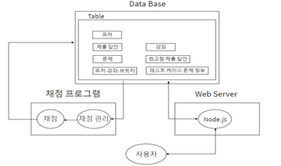

# Sejong-SQL-OJ

## 📄 개요  

- **세종대학교 학생이면 누구든 사용할 수 있는 SQL-OJ 서비스 구현**

  'Sejong SQL OJ'는 사용자의 입력 쿼리문을 관리자가 만들어 놓은 테이블에 적용시켜 정오답을 가리는 온라인 채점 프로그램이다. 기존에 데이터 베이스 수업 내에 손코딩으로 이루어졌던 평가 방식에서 편의성과 효율성 그리고 교육의 질을 더 높이고자 개발되었다.

  

## ⚙기술 스택  

   

## 🧾개발 목표 

* #### 편의성

  본교 데이터베이스 수업의 실습과 시험의 편의성을 높이고자 SQL OJ 시스템을 구현한다.

* #### 상용화

  프로젝트 개발 시 본교 데이터베이스 수업에서 SQL OJ가 상용화 될 수 있도록 한다. 

## 📈시스템 구조도

웹 서버는 데이터베이스에서 보내준 데이터를 사용자에게 전달하며 채점 프로그램은 유저가 작성한   쿼리문과 데이터베이스에 저장된 각 테스트케이스별 정답을 비교하여 채점합니다. 

## 🖥 실행 화면

## 😘기대효과

* #### 편의성증가

  교내 데이터베이스 수업에서 실습과 과제 수행이 편리해 진다.

  가시성이 좋은 테이블을 제공함으로서 피로를 덜 수 있다.

* #### 학습 능력 향상

  교내 데이터베이스 수업에서 다양한 평가 방식을 적용할 수 있다.

  손코딩이 아니라 타이핑을 통해 코딩함으로서 SQL언어에 능숙해 질 수 있다.

## 🧑‍💻 팀 소개  

### 백엔드

허준현 [@denhur62](https://github.com/denhur62)

김영률 [@GeomJa](https://github.com/donut0310)

### 프론트엔드

김진성[@Jaster25](https://github.com/Jaster25)

이기은 [@KE422](https://github.com/KE422)

##  🧔팀원별 맡은 역할

| **허준현** | 프로젝트 기획 및 총괄(PM)                         |
| ---------- | ------------------------------------------------- |
| **김진성** | 웹 프론트 설계 및 구현, API 개발                  |
| **이기은** | UI 디자인, 웹 프론트 설계 및 구현                 |
| **김영률** | AWS 서버 환경 구축, 서버 API 개발 및  성능 최적화 |

세부사항은 [Sejong-SQL-OJ 노션](https://www.notion.so/Sejong-SQL-OJ-df4d4127289540848659fb16cdddc392) 을 확인해 주세요!

